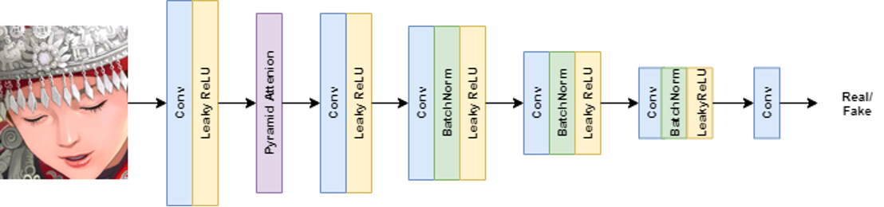
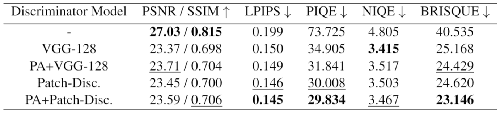

# ESRGAN_Attention

Experiments on ESRGAN models with attention modules

This repository contains models based on the enhanced deep residual networks for single image super-resolution \
(EDSR), with the addition of various attention modules to improve the upscaling results. 

### Models
SRGAN was one of the first generative adversarial model trained for single image super-resolution up to an upscaling factor of 4. Based on that, \
enhanced SRGAN (ESRGAN) improved the upscaling performance by modifying the overall architecture. In the generator model, batch normalization is removed  and residual-in-residual dense blocks (RRDB) are used to increase depth and connectivity of the network. Furthermore, a relativistic average discriminator is used, which predicts predicts a realsitic or fake batch relative to the ground truth data distribution.

### Datasets
DIV2K is a widely used dataset for training super-resolution models. It consists of 1000 high-definition RGB images \
of with a 2K resolution and a large diversity of content, split into a batch of 800 training images and 100 images each for validation and testing. \
For testing purposes, the widely used super-resolution datasets such as Set5, Set14 and Urban100 are used.

DIV2K can be downloaded using this link: https://data.vision.ee.ethz.ch/cvl/DIV2K/.

### Evaluation
The metrics used for evaluating model performance and image reconstruction quality in general are \
the pixelwise signal-to-noise ratio PSNR and the structural similarity index metric SSIM. \

### Results
This table shows the results for the different dicriminator models. The discriminator architectures marked with PA are \
enhanced with a pyramid attention mechanism.

